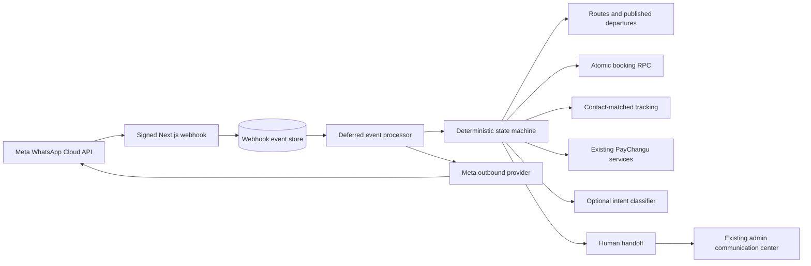

# WhatsApp customer service and booking

Status: implemented behind `WHATSAPP_BOT_ENABLED=false`. Meta business review,
number registration, template approval, staging migration, interrupted-event
recovery scheduling, and production deployment remain manual.

## Architecture

The Meta transport, conversation state, business operations, and optional AI
classifier are separate. AI classifies an utterance into a closed intent set;
it cannot call tools, mutate data, choose prices, or formulate unsupported
policy. Guided flows continue when AI is absent.

Current Meta message shapes were checked against Meta's official
[WhatsApp Cloud API Postman collection](https://www.postman.com/meta/whatsapp-business-platform/documentation/wlk6lh4/whatsapp-cloud-api)
and Meta-hosted [interactive message SDK reference](https://whatsapp.github.io/WhatsApp-Nodejs-SDK/api-reference/messages/interactive/).
The Graph version is required configuration rather than a source-code constant.

## Data and retention

The migration `db/migrations/2026_08_10_whatsapp_customer_service.sql` adds:

- published `route_departures`, with real travel dates and capacity;
- WhatsApp contacts, conversation control/state, webhook events, notes, and
  booking-operation idempotency;
- additive WhatsApp delivery fields on the existing communication transcript;
- an atomic capacity-checked booking RPC;
- service-role-only event/state functions and deny-by-default RLS.

`db/migrations/2026_08_11_whatsapp_event_recovery.sql` (additive, **not
applied**) adds `recover_whatsapp_webhook_events(...)` for selecting
interrupted webhook events. It needs a scheduled caller that does not yet
exist — see the recovery note under "Security review".

Message content is eligible for deletion after 90 days. Redacted webhook-event
metadata is eligible after one year. `cleanup_whatsapp_retention()` performs the
deletion only when an operator explicitly schedules or invokes it. Booking and
payment records are excluded.

## Local and staging setup

1. Keep `WHATSAPP_BOT_ENABLED=false`.
2. Create an isolated Meta development app and use Meta's test number. Do not
   register the production number.
3. Add the placeholder variables documented in `.env.example`. Use a long,
   random webhook verification token and the Meta App Secret. Never prefix
   secrets with `NEXT_PUBLIC_`.
4. Apply migrations through the documented order to an isolated Supabase
   staging project. Do not apply them to production during development.
5. Create active structured routes with trusted fares and pickup points.
   Legacy `settings.routes` values are not silently converted or treated as
   capacity-backed routes. Migrate them to structured routes through the
   existing route-model program after business review.
6. Use `POST /api/admin/whatsapp/departures` as an authenticated admin to create
   a draft/published departure. Capacity must be 1–500 and the route must be
   active with a positive fare. `PATCH` changes capacity or lifecycle status.
7. Deploy the staging build over HTTPS, then set Meta's callback URL to
   `https://STAGING_HOST/api/whatsapp/webhook` and enter the same verification
   token. Subscribe the WABA `messages` webhook field manually.
8. With `WHATSAPP_BOT_ENABLED=false`, verify only the GET challenge and the
   POST signature check (a signed POST returns `{ "success": true, "enabled":
   false }` and stores nothing). Nothing is written to `whatsapp_webhook_events`
   until the flag is on, so event persistence and processing can only be
   verified after step 9.
9. Set `WHATSAPP_BUSINESS_ACCOUNT_ID` and `WHATSAPP_PHONE_NUMBER_ID` to the
   values from the Meta dashboard, then turn `WHATSAPP_BOT_ENABLED=true` in
   staging and send Meta dashboard test events. Confirm rows appear in
   `whatsapp_webhook_events` and a reply is delivered.

Webhook behaviour, by phase:

- **GET verification** echoes `hub.challenge` only when `hub.mode=subscribe`
  and the token matches; 503 if the verify token / app secret are unset.
- **POST acknowledgement** verifies `X-Hub-Signature-256` over the exact raw
  body before JSON parsing, then returns 200 quickly.
- **Disabled mode** (`WHATSAPP_BOT_ENABLED` not `true`): the challenge and
  signature are still enforced, but the body is acknowledged and discarded —
  no persistence, no processing.
- **Account check** (enabled): events whose `entry[].id` (WABA ID) or
  `value.metadata.phone_number_id` do not match `WHATSAPP_BUSINESS_ACCOUNT_ID`
  / `WHATSAPP_PHONE_NUMBER_ID` are dropped per event (a mixed batch keeps its
  matching half). If those identifiers are unset the request is acknowledged
  without storing.
- **Persistence**: accepted events are stored under unique Meta-derived IDs
  (`storeWebhookEvent`), deduplicated by `idempotency_key`.
- **Processing**: a deferred `after()` callback runs `processWhatsAppEvent`
  for each stored event, in order. Delivery of any outbound reply happens here
  and is not reflected in the 200 already returned. Failures remain in
  `whatsapp_webhook_events` (see "recovery" below).

## Customer behavior

- New contacts choose English or Chichewa, then receive a seven-item list menu.
- Reply buttons are used only for three or fewer choices. Every interactive
  message stores/supplies a numbered text fallback.
- `menu`, `back`, `cancel`, `restart`, `English`, `Chichewa`, `STOP`, and `START`
  are global commands.
- Booking supports only published departures. Fare, fee, route status, date,
  and remaining seats are re-read server-side at confirmation.
- The confirmation Meta message ID is the durable booking operation key.
- Tracking uses the inbound Meta phone identity plus booking ID and returns only
  route, travel date, journey status, booking-fee state, and pickup.
- PayChangu links use existing contact ownership checks. Existing active links
  are reused, and payment truth comes from provider verification/finalization.
- Card details and mobile-money PINs are never requested in WhatsApp.
- Human mode suppresses automated responses. `STOP` remains available as an
  essential safety command.

## Admin inbox

Open **Admin → Communication center → WhatsApp** (the `WhatsApp` tab in
`app/admin/(sub)/communication/page.tsx`; also reachable via
`?tab=whatsapp`). Every `/api/admin/whatsapp/*` handler calls
`requireWhatsAppAdmin` server-side, which resolves the role from the
`admins`/`profiles` tables (never client metadata) and rejects cross-site
requests; the UI tab is only a convenience, not the control. Conversations put
into `waiting` by a handoff request appear here immediately under the
`waiting` filter, so a handoff never strands the customer in an inbox nobody
can open.

Administrators can search by contact name, phone, booking ID, or state; filter
bot/waiting/human/resolved conversations; view delivery states and related
booking/payment summaries; take over; assign an admin; reply; resolve; return
to bot; and add internal notes. Notes use a separate table and are never passed
to the Meta sender.

Free-form replies are allowed only inside the rolling 24-hour customer-service
window. Outside it, the API requires a template name present in
`WHATSAPP_APPROVED_TEMPLATE_NAMES`. Draft names must not be added until Meta has
actually approved them.

## Security review

- Raw-body HMAC-SHA256 verification with timing-safe comparison.
- Unique inbound Meta message IDs and unique booking operation keys.
- Optimistic state versions prevent concurrent double transitions.
- Capacity and booking insertion occur in one locked Postgres transaction.
- Service-role access stays in server-only modules; new data tables default deny.
- Per-contact rate-limit keys are hashed so phone numbers do not enter logs.
- Tracking failures use generic responses and log only conversation/count data.
- Event payloads are minimized and message text is removed from event rows after
  it is written to the retention-controlled transcript.
- Provider responses, tokens, payment links, message bodies, and phone numbers
  are excluded from structured logs.
- Admin mutations reject cross-site browser requests and recheck authorization
  inside each route handler.
- The optional classifier has a closed output vocabulary, no tools, no secrets,
  no customer records, and an eight-second timeout.
- Inbound events are only persisted/processed when both the WABA ID and phone
  number ID in the payload match server configuration. A mixed batch is
  filtered per event. Rejection logs carry counts only, never the customer.
- Processing is split: an idempotent persistence phase (safe to re-claim on
  failure) and a side-effecting handling phase. A handling failure after
  persistence marks the event `processed`, not `failed`, because outbound
  WhatsApp sends have no idempotency key and must not be blind-replayed.
  Bookings and payments are separately idempotent by operation key.

Known operational limitation — recovery still incomplete: `after()` is bounded
by the hosting function's duration, so an interrupted run can leave an event in
`received` or `processing`. `db/migrations/2026_08_11_whatsapp_event_recovery.sql`
adds `recover_whatsapp_webhook_events(...)` to *select* stuck rows and reset a
stale claim, but it is NOT APPLIED and there is still no scheduled caller. A
reviewed cron route (gated by `CRON_SECRET`, like `/api/cron/expire-bookings`)
that claims and reprocesses those ids is required before meaningful volume.
Events marked `processed` after a Phase 2 failure are intentionally out of
scope for automatic recovery — reconcile them from the admin inbox.

## Deployment checklist

- [ ] Human-review every Chichewa string listed by
  `chichewaHumanReviewKeys`.
- [ ] Apply and verify the migration in isolated staging.
- [ ] Publish real departure dates/capacities; do not invent or seed them.
- [ ] Run `npm run test:whatsapp`, full tests, lint, typecheck, and build.
- [ ] Confirm PayChangu uses sandbox credentials in staging.
- [ ] Configure Meta test-number credentials and callback manually.
- [ ] Set `WHATSAPP_BUSINESS_ACCOUNT_ID` and `WHATSAPP_PHONE_NUMBER_ID` to the
  real dashboard values; confirm mismatched-account events are ignored.
- [ ] Confirm secrets are server-only and absent from logs/client bundles.
- [ ] Exercise duplicate delivery, concurrent seat booking, human takeover,
  opt-out, provider outage, and payment-confirmation scenarios.
- [ ] Obtain Meta approval for templates; then add only approved names to the
  environment allowlist.
- [ ] Review, apply and exercise
  `2026_08_11_whatsapp_event_recovery.sql`, then build and schedule the cron
  caller it documents. Until then, stuck events are only recoverable manually.
- [ ] Add alerts for failed/stuck webhook events and outbound failures.
- [ ] Take a database backup and record migration/application versions.
- [ ] Enable in staging, observe, then request separate production approval.

## Rollback

1. Set `WHATSAPP_BOT_ENABLED=false` first. This stops event persistence,
   automated replies, and live bot operations while keeping signature checks.
2. Remove/disable the Meta webhook subscription manually if required.
3. Revert the application deployment. Existing web booking and PayChangu routes
   remain independent.
4. Leave additive tables/columns in place for reconciliation and retention.
   Do not run a destructive down migration during an incident.
5. Reconcile `processing`/`failed` events and initialized payments before any
   later cleanup. Remove schema only through a separately reviewed migration.

## Manual assumptions and remaining configuration

- Meta business review is pending and no live number is registered.
- No template is assumed approved.
- Only structured routes with published departures are bookable by the bot.
- The customer-service window is 24 hours from the last inbound message.
- Transcript content retention is 90 days; operational metadata is one year.
- Chichewa operational/payment terminology requires a fluent human reviewer.
- Production migrations, credentials, webhook subscription, alerting, recovery
  scheduling, template submission, and feature enablement are manual.
- `WHATSAPP_BUSINESS_ACCOUNT_ID` / `WHATSAPP_PHONE_NUMBER_ID` must be set for
  the webhook to accept any event once enabled; unset means acknowledge-only.
- Automatic recovery of interrupted events is not implemented (migration
  drafted, unapplied, no scheduler).

## File summary

- `lib/whatsapp/*`: provider, parsing, signatures, state, localization,
  repository, transactional domain adapters, controlled AI, and notifications.
- `app/api/whatsapp/webhook`: Meta verification, signed ingress, account-id
  filtering, deferred sequential processing.
- `app/api/admin/whatsapp/*`: departure and inbox administration.
- `app/admin/(sub)/communication/whatsapp-inbox.tsx`: admin inbox UI, mounted
  as the `WhatsApp` tab in `app/admin/(sub)/communication/page.tsx`.
- `db/migrations/2026_08_10_whatsapp_customer_service.sql`: additive schema/RPCs.
- `db/migrations/2026_08_11_whatsapp_event_recovery.sql`: additive
  recovery-selection function. NOT APPLIED; needs a scheduled caller.
- `.env.example`: placeholders and disabled-by-default feature configuration.
- `docs/whatsapp/*`: setup, templates, tests, security, deployment, and rollback.

